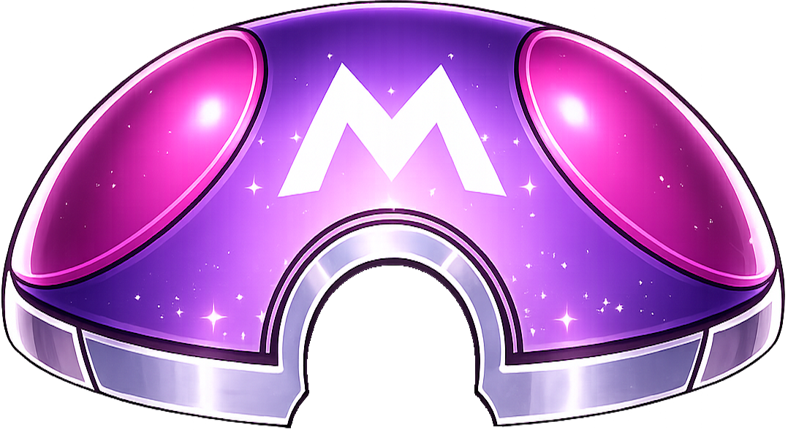

<h1 align="center"><b>Hola, soy Aster 🌟</b></h1>
<!--  -->

<b>Abrir perfil</b>

 

  

      
  

    

    
    

✮ Sobre mí

## 👋 Sobre mí

🎀 ¡Hola! Soy **Aster**  
💻 Desarrollador **Backend & Frontend**  
🗄️ Ingeniero en **Bases de Datos**  
🎮 Programador de **Videojuegos**  

Me apasiona crear soluciones eficientes, optimizar sistemas y desarrollar experiencias interactivas.  
Disfruto trabajar tanto en la lógica del servidor como en interfaces atractivas y funcionales.

---

## 🌎 Idiomas

- 🇪🇸 Español — Nativo  
- 🇺🇸 Inglés — Fluido  

---

✨ Siempre aprendiendo, siempre construyendo.

🛠 Herramientas

 

### 🧠 Lenguajes

---

### ⚛️ Front-end

---

### 🗄️ Bases de Datos

---

### 💻 Herramientas

---

### 🤖 IA

 

  
Estadísticas de GitHub

   
  

    
  

  
Contribuciones Open Source

   
  <ul>
    <li><strong>MDN Docs - Documentación Oficial de JavaScript:</strong> Contribuí a mejorar y mantener la documentación oficial de JavaScript en MDN Web Docs.</li>
    <li><strong>Pinterest - Pymemcache:</strong> Contribuciones al proyecto Pymemcache, cliente eficiente en Python para memcached.</li>
    <li><strong>The Algorithms - JavaScript y C++:</strong> Implementaciones de algoritmos y estructuras de datos.</li>
    <li><strong>True Sparrow:</strong> Lideré proyectos desde su inicio hasta producción.</li>
  </ul>

  
Frase

   
  <blockquote>
    “Un bug nunca es solo un error. Representa algo más grande. Un error de pensamiento. Eso es lo que te define.”
     <strong>Mr. Robot - Elliot Alderson</strong>
  </blockquote>

  
Dosis GRATIS

   
  <small><i>DOSE (dopamina, oxitocina, serotonina y endorfina), actualiza la página si la dosis no fue efectiva.</i></small>
   
  

¿Qué puedo hacer por ti?

## ¡Trabajemos juntos en tu proyecto!

Si tienes preguntas sobre desarrollo web, documentación o IA, no dudes en contactarme por correo. No muerdo, lo prometo.

## No es perfecto, ¿verdad?

“Creo que es muy importante tener un ciclo de retroalimentación constante, donde estés pensando en lo que has hecho y cómo podrías hacerlo mejor.”  
– Elon Musk

------

Crédito: [10Kartik](https://github.com/10Kartik)
